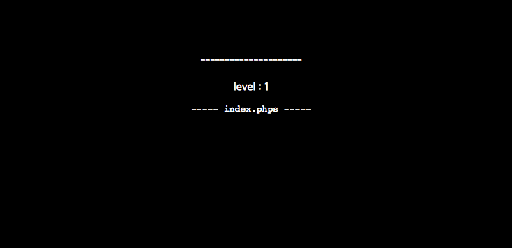
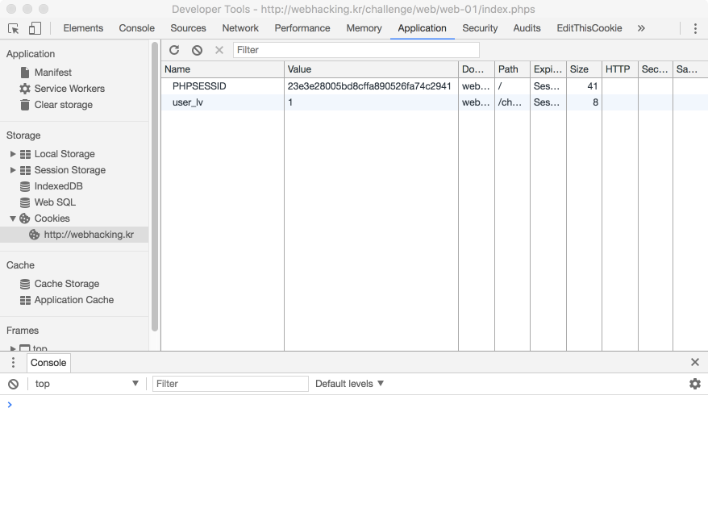

# webhacking.kr No.1

## 문제 출제 의도

Cookie를 원하는 값으로 조작할 수 있는지 확인한다.

## 풀이

1번 문제에 접속하면 다음과 같은 화면을 볼 수 있다.



친절하게 index.phps를 보라고 안내해 주고 있으니 한 번 들어가보자.

`http://webhacking.kr/challenge/web/web-01/`**index.phps**

그러면 딱 봐도 index.php의 소스코드같이 생긴 게 출력된다.

```php
<?
if(!$_COOKIE[user_lv])
{
SetCookie("user_lv","1");
echo("<meta http-equiv=refresh content=0>");
}
?>
<html>
<head>
<title>Challenge 1</title>
</head>
<body bgcolor=black>
<center>
<br><br><br><br><br>
<font color=white>
---------------------<br>
<?

$password="????";

if(eregi("[^0-9,.]",$_COOKIE[user_lv])) $_COOKIE[user_lv]=1;

if($_COOKIE[user_lv]>=6) $_COOKIE[user_lv]=1;

if($_COOKIE[user_lv]>5) @solve();

echo("<br>level : $_COOKIE[user_lv]");

?>
<br>
<pre>
<a onclick=location.href='index.phps'>----- index.phps -----</a>
</body>
</html>
```

-----

## PHP Reserved Variables

PHP에는 많은 **미리 정의된 변수**가 존재한다. 그 중 하나가 바로 `$_COOKIE`이고, 이는 HTTP Cookie와 관련된 정보를 제공한다.

PHP의 미리 정의된 변수 또는 `$_COOKIE`에 대해 잘 모르겠다면 다음 링크를 참고하자.

* [PHP: 미리 정의된 변수 - Manual](http://php.net/manual/kr/reserved.variables.php)
* [PHP: $_COOKIE - Manual](http://php.net/manual/kr/reserved.variables.cookies.php)

## Cookie

Cookie는 **클라이언트의 웹 브라우저에 저장**되는 작은 데이터 파일이다. 클라이언트가 수정할 수 있으며, 주로 세션 관리, 개인화, 트래킹을 위해 사용된다.

Cookie에 대해 잘 모르겠다면 다음 링크를 참고하자.

* [HTTP 쿠키 - HTTP | MDN](https://developer.mozilla.org/ko/docs/Web/HTTP/Cookies)
* [HTTP 쿠키 - 위키백과](https://ko.wikipedia.org/wiki/HTTP_%EC%BF%A0%ED%82%A4)

## SetCookie

PHP의 SetCookie() 함수는 쿠키로 데이터를 저장하도록 응답 헤더를 설정하는 함수이다.

```php
bool setcookie ( string $name [, string $value = "" [, int $expire = 0 [, string $path = "" [, string $domain = "" [, bool $secure = false [, bool $httponly = false ]]]]]] )
```

PHP의 SetCookie() 함수에 대해 잘 모르겠다면 다음 링크를 참고하자.

* [PHP: setcookie - Manual](http://php.net/manual/kr/function.setcookie.php)

참고로 PHP에서 변수, 상수명을 제외한 문법은 대소문자를 구분하지 않는다.
즉, SetCookie()와 setcookie()는 동일한 함수이다.

## eregi

PHP의 eregi() 함수는 정규표현식을 대상 문자열에 매치하는 함수이다. 반환값은 매치된 문자열이 존재할 경우 매치된 문자열의 길이이고, 매치된 문자열이 존재하지 않을 경우 FALSE이다.

PHP eregi() 함수에 대해 잘 모르겠다면 다음 링크를 참고하자.

* [PHP: eregi - Manual](http://docs.php.net/manual/kr/function.eregi.php)

-----

```php
if(!$_COOKIE[user_lv])
{
SetCookie("user_lv","1");
echo("<meta http-equiv=refresh content=0>");
}
```

이름이 user_lv인 쿠키가 설정되지 않았거나 값이 0이면 쿠키 user_lv의 값을 1로 설정하고 새로고침 하도록 한다.

```php
<?

$password="????";

if(eregi("[^0-9,.]",$_COOKIE[user_lv])) $_COOKIE[user_lv]=1;

if($_COOKIE[user_lv]>=6) $_COOKIE[user_lv]=1;

if($_COOKIE[user_lv]>5) @solve();

echo("<br>level : $_COOKIE[user_lv]");

?>
```

`$_COOKIE[user_lv]`가 `숫자 0~9`, `,`, `.`을 제외한 다른 문자를 포함하고 있다면 `$_COOKIE[user_lv]`의 값을 1로 변경한다.

`$_COOKIE[user_lv]`의 값이 6 이상이면 `$_COOKIE[user_lv]`의 값을 1로 변경한다.

`$_COOKIE[user_lv]`의 값이 5 초과면 문제가 풀린다.

`$_COOKIE[user_lv]`의 값을 출력한다.

## Solution

이 문제는 `$_COOKIE[user_lv]`의 값이 5 초과 6 미만이 되도록 쿠키의 조작을 요구한다.

Cookie를 변경하기 위해 Chrome 웹 브라우저의 개발자 도구를 사용할 수 있다.

윈도우 운영체제에서는 F12키를, Mac OS X에서는 cmd+option+i를 누르면 Chrome 개발자 도구가 나온다.

상단 Application 탭을 누르고, 좌측 메뉴에서 Cookies를 선택한 후, URL을 고르면 해당 사이트에서 저장된 Cookie들을 볼 수 있다. 우측 리스트에서 수정을 원하는 값을 더블 클릭하면 값을 수정할 수 있다.



값은 `숫자 0~9`, `,`, `.`이 필터링 되지 않고 사용 가능하므로 `5.1`, `5.8`과 같은 숫자를 `user_lv`의 값으로 넣고 페이지를 새로고침 하면 문제가 풀린다.

[EditThisCookie](https://chrome.google.com/webstore/detail/editthiscookie/fngmhnnpilhplaeedifhccceomclgfbg?hl=ko)와 같은 도구를 설치하면 더욱 편하게 쿠키를 확인하고 변경할 수 있다.